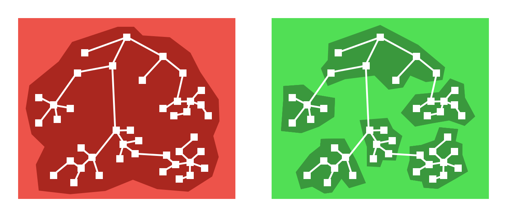

## What to expect

Splitting your bundle into small pieces allows you reduce size of main bundle, which is loaded on application startup. It means, that you can load only necessary things, such as login pages, which user inevitably will see if open an application. And only "necessary" things will be in main bundle. Thus, this means that **the time of initial launch of the application will be minimized** and **memory consumption will be decreased**, since often in applications is a lot of code (components and screens) that the user may simply not see.

<p style="text-align:center">
 </img>
 <i>On green part of this picture, we can see that all components/screens are divided into different groups. It allows you to load the application much faster, because instead of loading the entire bundle (red picture), you can load only the parts that we need.</i>
</p>

## Features
This library is add-on on react-native API. But this library has some features, and here is list of them:
- **Enhanced cache management**. This library provide a way for caching yours components. This mechanism allows you to improve performance of your application and help to avoid unnecessary reloading yours components, which were already loaded.
- **Ability to preload component**. You can preload components in background, which user may see in the nearest future. It allows to make UI experience more smooth and use your components from cache without any intermittentions.
- **Supporting all navigation libraries**. This library is compatible with all most known navigation libraries, such as [react-navigation](https://reactnavigation.org/), [react-native-navigation](https://wix.github.io/react-native-navigation/#/) and more others.

## Installation

Install the react-native-bundle-splitter package in your React Native project.

```bash
yarn add react-native-bundle-splitter
# or with npm
# npm install react-native-bundle-splitter --save
```

This module does not use any native (platform) dependencies and does not need to be linked. So installation process basically is finished. But you also need to enable `RAM bundles` feature in your application. To see how to do it, please read [the guide](docs-fundamentals-enabling-ram-bundle.md).

> *Note*: you need to use react-native 0.59 or higher, since feature with inline requires is available out-of-box only from this version.